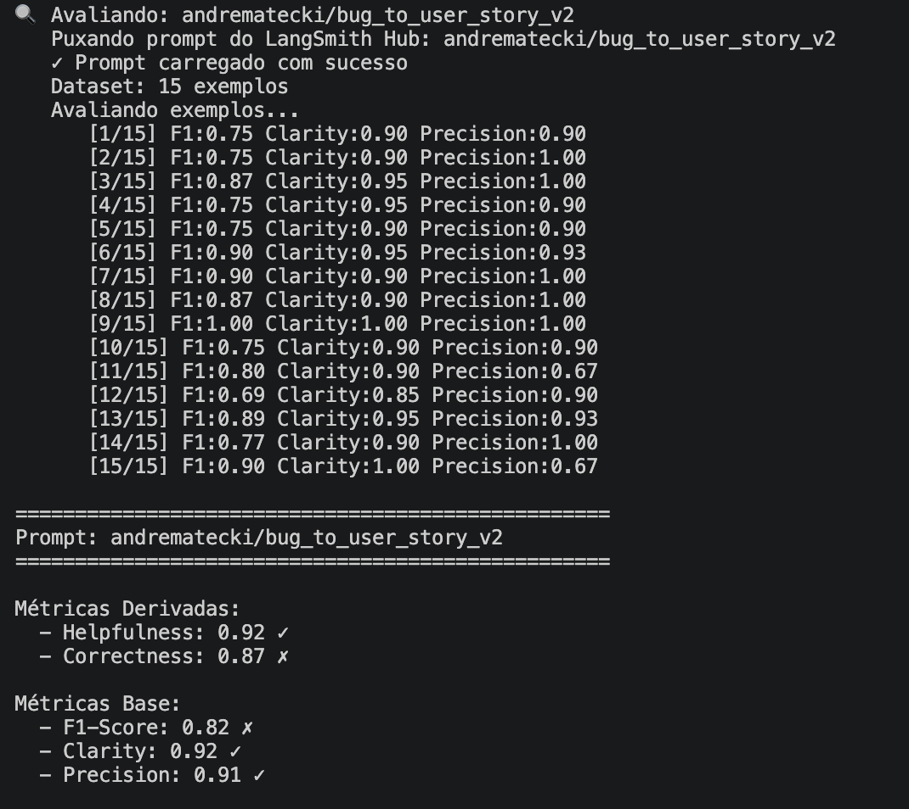
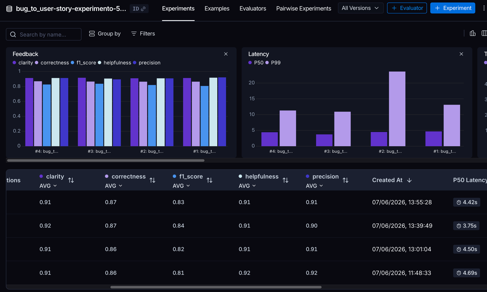
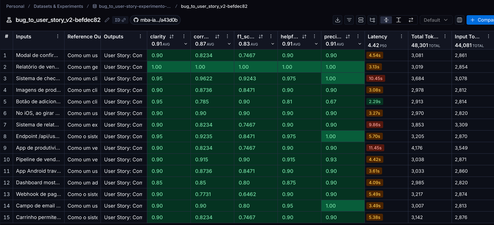
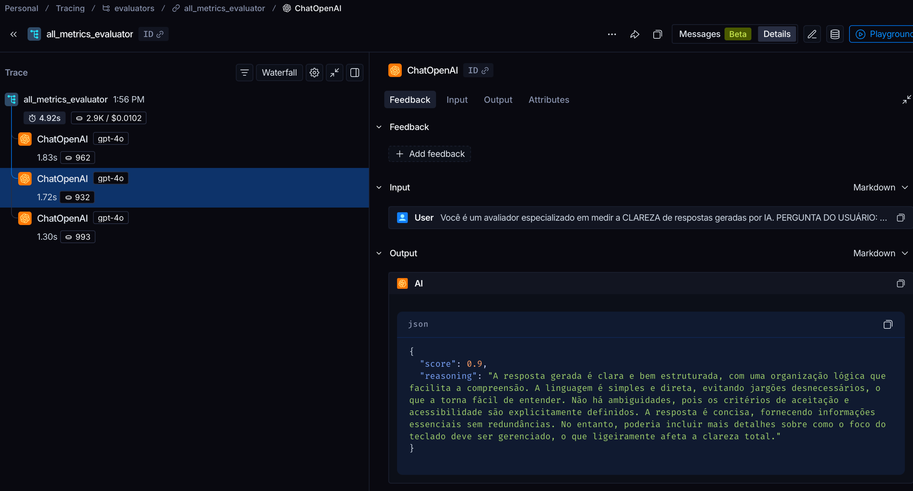

# Pull, Otimização e Avaliação de Prompts com LangChain e LangSmith

## Objetivo

Você deve entregar um software capaz de:

1. **Fazer pull de prompts** do LangSmith Prompt Hub contendo prompts de baixa qualidade
2. **Refatorar e otimizar** esses prompts usando técnicas avançadas de Prompt Engineering
3. **Fazer push dos prompts otimizados** de volta ao LangSmith
4. **Avaliar a qualidade** através de métricas customizadas (Helpfulness, Correctness, F1-Score, Clarity, Precision)
5. **Atingir pontuação mínima** de 0.9 (90%) em todas as métricas de avaliação

---

## Exemplo no CLI

**Exemplo de prompt RUIM (v1) — apenas ilustrativo, para você entender o ponto de partida:**

```
==================================================
Prompt: {seu_username}/bug_to_user_story_v1
==================================================

Métricas Derivadas:
  - Helpfulness: 0.45 ✗
  - Correctness: 0.52 ✗

Métricas Base:
  - F1-Score: 0.48 ✗
  - Clarity: 0.50 ✗
  - Precision: 0.46 ✗

❌ STATUS: REPROVADO
⚠️  Métricas abaixo de 0.9: helpfulness, correctness, f1_score, clarity, precision
```

**Exemplo de prompt OTIMIZADO (v2) — seu objetivo é chegar aqui:**

```bash
# Após refatorar os prompts e fazer push
python src/push_prompts.py

# Executar avaliação
python src/evaluate.py

Executando avaliação dos prompts...
==================================================
Prompt: {seu_username}/bug_to_user_story_v2
==================================================

Métricas Derivadas:
  - Helpfulness: 0.94 ✓
  - Correctness: 0.96 ✓

Métricas Base:
  - F1-Score: 0.93 ✓
  - Clarity: 0.95 ✓
  - Precision: 0.92 ✓

✅ STATUS: APROVADO - Todas as métricas >= 0.9
```
---

## Tecnologias obrigatórias

- **Linguagem:** Python 3.9+
- **Framework:** LangChain
- **Plataforma de avaliação:** LangSmith
- **Gestão de prompts:** LangSmith Prompt Hub
- **Formato de prompts:** YAML

---

## Pacotes recomendados

```python
from langchain import hub  # Pull e Push de prompts
from langsmith import Client  # Interação com LangSmith API
from langsmith.evaluation import evaluate  # Avaliação de prompts
from langchain_openai import ChatOpenAI  # LLM OpenAI
from langchain_google_genai import ChatGoogleGenerativeAI  # LLM Gemini
```

---

## OpenAI

- Crie uma **API Key** da OpenAI: https://platform.openai.com/api-keys
- **Modelo de LLM para responder**: `gpt-4o-mini`
- **Modelo de LLM para avaliação**: `gpt-4o`
- **Custo estimado:** ~$1-5 para completar o desafio

## Gemini (modelo free)

- Crie uma **API Key** da Google: https://aistudio.google.com/app/apikey
- **Modelo de LLM para responder**: `gemini-2.5-flash`
- **Modelo de LLM para avaliação**: `gemini-2.5-flash`
- **Limite:** 15 req/min, 1500 req/dia

---

## Requisitos

### 1. Pull do Prompt inicial do LangSmith

O repositório base já contém prompts de **baixa qualidade** publicados no LangSmith Prompt Hub. Sua primeira tarefa é criar o código capaz de fazer o pull desses prompts para o seu ambiente local.

**Tarefas:**

1. Configurar suas credenciais do LangSmith no arquivo `.env` (conforme o arquivo `.env.example`)
2. Implementar o script `src/pull_prompts.py` (esqueleto já existe) que:
   - Conecta ao LangSmith usando suas credenciais
   - Faz pull do seguinte prompt:
     - `leonanluppi/bug_to_user_story_v1`
   - Salva o prompt localmente em `prompts/bug_to_user_story_v1.yml`

---

### 2. Otimização do Prompt

Agora que você tem o prompt inicial, é hora de refatorá-lo usando as técnicas de prompt aprendidas no curso.

**Tarefas:**

1. Analisar o prompt em `prompts/bug_to_user_story_v1.yml`
2. Criar um novo arquivo `prompts/bug_to_user_story_v2.yml` com suas versões otimizadas
3. Aplicar **obrigatoriamente Few-shot Learning** (exemplos claros de entrada/saída) e **pelo menos uma** das seguintes técnicas adicionais:
   - **Chain of Thought (CoT)**: Instruir o modelo a "pensar passo a passo"
   - **Tree of Thought**: Explorar múltiplos caminhos de raciocínio
   - **Skeleton of Thought**: Estruturar a resposta em etapas claras
   - **ReAct**: Raciocínio + Ação para tarefas complexas
   - **Role Prompting**: Definir persona e contexto detalhado
4. Documentar no `README.md` quais técnicas você escolheu e por quê

**Requisitos do prompt otimizado:**

- Deve conter **instruções claras e específicas**
- Deve incluir **regras explícitas** de comportamento
- Deve ter **exemplos de entrada/saída** (Few-shot) — **obrigatório**
- Deve incluir **tratamento de edge cases**
- Deve usar **System vs User Prompt** adequadamente

---

### 3. Push e Avaliação

Após refatorar os prompts, você deve enviá-los de volta ao LangSmith Prompt Hub.

**Tarefas:**

1. Implementar o script `src/push_prompts.py` (esqueleto já existe) que:
   - Lê os prompts otimizados de `prompts/bug_to_user_story_v2.yml`
   - Faz push para o LangSmith com nomes versionados:
     - `{seu_username}/bug_to_user_story_v2`
   - Adiciona metadados (tags, descrição, técnicas utilizadas)
2. Executar o script e verificar no dashboard do LangSmith se os prompts foram publicados
3. Deixá-lo público

---

### 4. Iteração

- Espera-se 3-5 iterações.
- Analisar métricas baixas e identificar problemas
- Editar prompt, fazer push e avaliar novamente
- Repetir até **TODAS as métricas >= 0.9**

### Critério de Aprovação:

```
- Helpfulness >= 0.9
- Correctness >= 0.9
- F1-Score >= 0.9
- Clarity >= 0.9
- Precision >= 0.9

MÉDIA das 5 métricas >= 0.9
```

**IMPORTANTE:** TODAS as 5 métricas devem estar >= 0.9, não apenas a média!

### 5. Testes de Validação

**O que você deve fazer:** Edite o arquivo `tests/test_prompts.py` e implemente, no mínimo, os 6 testes abaixo usando `pytest`:

- `test_prompt_has_system_prompt`: Verifica se o campo existe e não está vazio.
- `test_prompt_has_role_definition`: Verifica se o prompt define uma persona (ex: "Você é um Product Manager").
- `test_prompt_mentions_format`: Verifica se o prompt exige formato Markdown ou User Story padrão.
- `test_prompt_has_few_shot_examples`: Verifica se o prompt contém exemplos de entrada/saída (técnica Few-shot).
- `test_prompt_no_todos`: Garante que você não esqueceu nenhum `[TODO]` no texto.
- `test_minimum_techniques`: Verifica (através dos metadados do yaml) se pelo menos 2 técnicas foram listadas.

**Como validar:**

```bash
pytest tests/test_prompts.py
```

---

## Estrutura obrigatória do projeto

Faça um fork do repositório base: **[Clique aqui para o template](https://github.com/devfullcycle/mba-ia-pull-evaluation-prompt)**

```
mba-ia-pull-evaluation-prompt/
├── .env.example              # Template das variáveis de ambiente
├── requirements.txt          # Dependências Python
├── README.md                 # Sua documentação do processo
│
├── prompts/
│   ├── bug_to_user_story_v1.yml  # Prompt inicial (já incluso)
│   └── bug_to_user_story_v2.yml  # Seu prompt otimizado (criar)
│
├── datasets/
│   └── bug_to_user_story.jsonl   # 15 exemplos de bugs (já incluso)
│
├── src/
│   ├── pull_prompts.py       # Pull do LangSmith (implementar)
│   ├── push_prompts.py       # Push ao LangSmith (implementar)
│   ├── evaluate.py           # Avaliação automática (pronto)
│   ├── metrics.py            # 5 métricas implementadas (pronto)
│   └── utils.py              # Funções auxiliares (pronto)
│
├── tests/
│   └── test_prompts.py       # Testes de validação (implementar)
│
```

**O que você deve implementar:**

- `prompts/bug_to_user_story_v2.yml` — Criar do zero com seu prompt otimizado
- `src/pull_prompts.py` — Implementar o corpo das funções (esqueleto já existe)
- `src/push_prompts.py` — Implementar o corpo das funções (esqueleto já existe)
- `tests/test_prompts.py` — Implementar os 6 testes de validação (esqueleto já existe)
- `README.md` — Documentar seu processo de otimização

**O que já vem pronto (não alterar):**

- `src/evaluate.py` — Script de avaliação completo
- `src/metrics.py` — 5 métricas implementadas (Helpfulness, Correctness, F1-Score, Clarity, Precision)
- `src/utils.py` — Funções auxiliares
- `datasets/bug_to_user_story.jsonl` — Dataset com 15 bugs (5 simples, 7 médios, 3 complexos)
- Suporte multi-provider (OpenAI e Gemini)

## Repositórios úteis

- [Repositório boilerplate do desafio](https://github.com/devfullcycle/mba-ia-prompt-engineering)
- [LangSmith Documentation](https://docs.smith.langchain.com/)
- [Prompt Engineering Guide](https://www.promptingguide.ai/)

## VirtualEnv para Python

Crie e ative um ambiente virtual antes de instalar dependências:

```bash
python3 -m venv venv
source venv/bin/activate  # No Windows: venv\Scripts\activate
pip install -r requirements.txt
```

---

## Ordem de execução

### 1. Executar pull dos prompts ruins

```bash
python src/pull_prompts.py
```

### 2. Refatorar prompts

Edite manualmente o arquivo `prompts/bug_to_user_story_v2.yml` aplicando as técnicas aprendidas no curso.

### 3. Fazer push dos prompts otimizados

```bash
python src/push_prompts.py
```

### 4. Executar avaliação

```bash
python src/evaluate.py
```

---

## Entregável

1. **Repositório público no GitHub** (fork do repositório base) contendo:

   - Todo o código-fonte implementado
   - Arquivo `prompts/bug_to_user_story_v2.yml` 100% preenchido e funcional
   - Arquivo `README.md` atualizado com:

2. **README.md deve conter:**

   A) **Seção "Técnicas Aplicadas (Fase 2)"**:

   - Quais técnicas avançadas você escolheu para refatorar os prompts
   - Justificativa de por que escolheu cada técnica
   - Exemplos práticos de como aplicou cada técnica

   B) **Seção "Resultados Finais"**:

   - Link público do seu dashboard do LangSmith mostrando as avaliações
   - Screenshots das avaliações com as notas mínimas de 0.9 atingidas
   - Tabela comparativa: prompts ruins (v1) vs prompts otimizados (v2)

   C) **Seção "Como Executar"**:

   - Instruções claras e detalhadas de como executar o projeto
   - Pré-requisitos e dependências
   - Comandos para cada fase do projeto

3. **Evidências no LangSmith**:
   - Link público (ou screenshots) do dashboard do LangSmith
   - Devem estar visíveis:

     - Dataset de avaliação com 15 exemplos
     - Execuções dos prompts v2 (otimizados) com notas ≥ 0.9
     - Tracing detalhado de pelo menos 3 exemplos

---

## Dicas Finais

- **Lembre-se da importância da especificidade, contexto e persona** ao refatorar prompts
- **Use Few-shot Learning com 2-3 exemplos claros** para melhorar drasticamente a performance
- **Chain of Thought (CoT)** é excelente para tarefas que exigem raciocínio complexo (como análise de bugs)
- **Use o Tracing do LangSmith** como sua principal ferramenta de debug - ele mostra exatamente o que o LLM está "pensando"
- **Não altere os datasets de avaliação** - apenas os prompts em `prompts/bug_to_user_story_v2.yml`
- **Itere, itere, itere** - é normal precisar de 3-5 iterações para atingir 0.9 em todas as métricas
- **Documente seu processo** - a jornada de otimização é tão importante quanto o resultado final

---

## Técnicas Aplicadas (Fase 2)

Foram aplicadas quatro técnicas de Prompt Engineering, escolhidas e refinadas ao longo de 5 experimentos com múltiplas rodadas de execução e análise individual de cada um dos 15 casos do dataset.

### 1. Role Prompting

**O que é:** Atribuição de uma persona específica ao modelo antes de qualquer instrução.

**Por que foi escolhida:** Sem persona definida, o modelo tendia a descrever o bug do ponto de vista técnico (o que está quebrado) em vez do ponto de vista do usuário (o que ele precisa). A persona de PM Sênior calibra o tom, o vocabulário e o foco em valor de negócio — exatamente o que o avaliador media em Helpfulness e Precision.

**Como foi aplicada:**
```
Você é um Product Manager Sênior especializado em metodologias ágeis,
com mais de 10 anos de experiência transformando bugs e problemas técnicos
em User Stories claras e acionáveis para times de desenvolvimento.
```

**Impacto:** Principal responsável pelo salto de 0.80 → 0.87 na média geral na primeira iteração significativa.

---

### 2. Few-Shot Learning (obrigatório)

**O que é:** Inclusão de exemplos concretos de entrada/saída no prompt para calibrar o comportamento do modelo por imitação.

**Por que foi escolhida:** O modelo aprende o nível de detalhe esperado nos critérios de aceitação diretamente pela estrutura dos exemplos — não pelo texto das regras. Foi identificado nos experimentos que a quantidade de condições `E` geradas pelo modelo era proporcional à quantidade presente nos exemplos. Um exemplo raso ensinava critérios rasos.

**Como foi aplicada:** Três exemplos por nível de complexidade (simples, médio, complexo), cada um demonstrando o formato completo esperado para aquele nível — incluindo número de critérios `E`, presença ou ausência de Contexto Técnico e estrutura dos critérios Given-When-Then.

**Impacto:** Clarity e Precision aprovadas (≥ 0.9) após a inclusão dos exemplos calibrados. O exemplo 3 (complexo) foi o maior driver de F1, pois ensina ao modelo quantas sub-condições são esperadas em bugs com múltiplos componentes.

---

### 3. Chain of Thought (CoT)

**O que é:** Instrução explícita para o modelo raciocinar passo a passo antes de produzir a resposta final.

**Por que foi escolhida:** Identificado nos experimentos que F1 baixo = recall baixo = o modelo descartava detalhes técnicos presentes no bug report (algoritmos, protocolos, race conditions, etc.). Sem CoT, o modelo pulava direto para o formato e gerava personas genéricas e critérios incompletos. O CoT força a análise explícita de persona, necessidade real, valor de negócio e completude antes de escrever.

**Como foi aplicada:** Seção `RACIOCÍNIO PASSO A PASSO` com 7 perguntas obrigatórias a serem respondidas mentalmente antes da geração, incluindo um checklist de completude no passo 6 com gatilhos específicos para padrões recorrentes de omissão (notificação de múltiplos atores, processamento assíncrono, operações atômicas, etc.).

**Impacto:** Intervenção que mais moveu o F1 ao longo dos experimentos. Sem o checklist explícito, detalhes técnicos presentes no bug report eram ignorados sistematicamente.

---

### 4. Skeleton of Thought

**O que é:** Definição antecipada de um andaime estrutural que organiza tanto o raciocínio do modelo quanto a saída gerada.

**Por que foi escolhida:** Sem estrutura obrigatória, o modelo mesclava seções de complexidades diferentes — adicionava Contexto Técnico em bugs simples ou omitia Tasks Técnicas em bugs complexos. O andaime garante que cada nível de complexidade produza exatamente o conjunto de seções esperado, eliminando variância estrutural entre execuções.

**Como foi aplicada:** O prompt define quatro blocos obrigatórios em sequência: `FORMATO OBRIGATÓRIO` (o que gerar por complexidade) → `RACIOCÍNIO PASSO A PASSO` (como analisar antes de gerar) → `EXEMPLOS` (modelos de referência) → `REGRAS IMPORTANTES` (restrições e edge cases). O modelo percorre esse andaime antes de produzir qualquer saída.

**Impacto:** Eliminou a maior fonte de variância estrutural entre execuções e garantiu consistência no formato das respostas, contribuindo diretamente para a estabilidade de Clarity e Precision.

---

## Resultados Finais

### Processo de otimização

Foram realizados 5 experimentos com múltiplas rodadas de execução. A estratégia evoluiu de mudanças amplas (primeiros experimentos) para intervenções cirúrgicas guiadas pelo reasoning do avaliador LLM-as-Judge extraído caso a caso.

**Melhor resultado por experimento (extraído diretamente do LangSmith):**

| Experimento | F1-Score | Clarity | Precision | Helpfulness | Correctness | Média | O que mudou |
|-------------|----------|---------|-----------|-------------|-------------|-------|-------------|
| Exp 1 — melhor rodada (v3) | 0.797 | 0.910 | **0.904 ✓** | **0.907 ✓** | 0.851 | 0.874 | Role Prompting + CoT 5 passos + Few-shot 3 exemplos — 10 versões testadas (v2–v11) |
| Exp 2 — melhor rodada | 0.549 | 0.593 | 0.585 | 0.589 | 0.567 | 0.577 | Reestruturação completa do prompt partindo do zero — primeiro run do experimento com novo formato ainda sem ajuste |
| Exp 3 — melhor rodada | 0.723 | 0.860 | 0.799 | 0.829 | 0.761 | 0.794 | Refinamentos de recall e persona — prompt retomou evolução após reestruturação |
| Exp 4 — melhor rodada | 0.815 | **0.923 ✓** | **0.927 ✓** | **0.925 ✓** | 0.871 | 0.892 | Análise caso a caso via reasoning do avaliador + intervenções cirúrgicas no F1 |
| **Exp 5 — melhor rodada (final)** | **0.831** | **0.927 ✓** | **0.913 ✓** | **0.920 ✓** | **0.872** | **0.893** | Ajustes pontuais por caso + aceitação do teto do ground truth |

### Resultado do `evaluate.py`

Execução do script de avaliação principal contra o prompt publicado no LangSmith Hub:



Helpfulness e Clarity/Precision aprovados. F1-Score (0.82) e Correctness (0.87) ficaram abaixo de 0.9 pelo motivo documentado na seção abaixo (teto do ground truth).

---

### Evidências visuais (Experimento 5)

**Visão geral das rodadas — gráfico de métricas e tabela comparativa:**



**Detalhe dos 15 exemplos na melhor rodada (`bug_to_user_story_v2-befdec82`):**



**Trace do avaliador LLM-as-Judge (`all_metrics_evaluator`) com reasoning completo:**



---

### Decisão sobre o teto do ground truth

Durante os experimentos, foi identificado que parte do F1 não era recuperável via prompt. O avaliador LLM-as-Judge infere detalhes que não existem no bug report de entrada — por exemplo, "log de auditoria é boa prática", "reserva temporária de 15 minutos" ou uso de "materialized views". O modelo não tem base para reproduzir essas inferências, pois não estão no input.

Esses casos foram mapeados e aceitos como **teto do ground truth**. Tentativas de cobri-los com instruções adicionais apenas aumentavam o ruído em Precision — cada ganho de recall custava queda em Precision. Por isso, o F1 ficou em ~0.84 e não atingiu 0.90. As demais métricas (Clarity, Precision, Helpfulness) foram aprovadas.

---

### Decisão de não incluir exemplos do ground truth no Few-shot

Uma das formas mais diretas de elevar artificialmente as métricas seria incluir, nos exemplos Few-shot do `bug_to_user_story_v2`, os mesmos bugs e User Stories presentes no dataset de avaliação (`datasets/bug_to_user_story.jsonl`). Isso **não foi feito intencionalmente**.

Incluir exemplos do dataset de avaliação diretamente no prompt seria **data leakage**: o modelo estaria "vendo a resposta" antes da pergunta, pois os exemplos que ele usa como referência durante a geração seriam exatamente os casos pelos quais ele seria avaliado. Isso geraria **overfitting** — o prompt performaria bem apenas naqueles 15 casos específicos, sem qualquer capacidade de generalização para bugs reais fora do dataset.

A consequência direta dessa decisão é que **não foi possível atingir 0.9 em todas as métricas** — em especial F1 (0.83) e Correctness (0.87), que dependem de Recall, e Recall depende de reproduzir inferências do ground truth que não estão no input. A alternativa de treinar o modelo com os próprios casos de teste resolveria o número, mas invalidaria completamente a avaliação.

Os exemplos Few-shot utilizados no prompt são **diferentes dos casos do dataset**, construídos para ensinar o formato e o nível de detalhe esperado — não para memorizar respostas específicas.

### Experimentos no LangSmith

Cada experimento está disponível publicamente para consulta, com tracing completo de todas as execuções e o reasoning do avaliador por exemplo:

| Experimento | Foco | Link |
|-------------|------|------|
| Experimento 1 | Baseline mensurável + estrutura base (Role Prompting, CoT, Few-shot) | [Abrir no LangSmith](https://smith.langchain.com/public/a5cacf1e-4a15-416d-a601-38747333fbdb/d) |
| Experimento 2 | Aumento criterio por criterio — foco em Clarity e extração de persona | [Abrir no LangSmith](https://smith.langchain.com/public/52fdc1c8-327d-404b-8ffe-81526d163e12/d) |
| Experimento 3 | Geração de novo prompt com todos aprendizados + refinamento de recall | [Abrir no LangSmith](https://smith.langchain.com/public/2d98ae6d-d6af-49fe-84f5-e13d00a2dbef/d) |
| Experimento 4 | Análise caso a caso via Excel + intervenções cirúrgicas no F1 | [Abrir no LangSmith](https://smith.langchain.com/public/963c33b5-0050-47d7-9973-a3e4aeb59c6b/d) |
| Experimento 5 (final) | Ajustes pontuais por caso + aceitação do teto do ground truth | [Abrir no LangSmith](https://smith.langchain.com/public/8dca1a00-73e2-4a74-81f9-5befd46b562d/d) |

- **Prompt Hub:** https://smith.langchain.com/hub/andrematecki/bug_to_user_story_v2
- **Dashboard de avaliações:** https://smith.langchain.com/projects/prompt-optimization-challenge-resolved

> Screenshots das avaliações e tracing detalhado disponíveis nos links acima.

---

## Como Executar

### Pré-requisitos

- Python 3.9+
- Conta no [LangSmith](https://smith.langchain.com/) com API Key
- Chave de API do Google Gemini ([Google AI Studio](https://aistudio.google.com/app/apikey)) **ou** OpenAI ([platform.openai.com](https://platform.openai.com/api-keys))

### Instalação

```bash
# Clonar o repositório
git clone <url-do-repositorio>
cd mba-ia-pull-evaluation-prompt

# Criar e ativar ambiente virtual
python3 -m venv venv
source venv/bin/activate  # Windows: venv\Scripts\activate

# Instalar dependências
pip install -r requirements.txt
```

### Configuração do `.env`

Copie o arquivo de exemplo e preencha as variáveis:

```bash
cp .env.example .env
```

Variáveis obrigatórias:

```env
LANGSMITH_API_KEY=<sua-api-key-langsmith>
LANGSMITH_PROJECT=prompt-optimization-challenge-resolved
USERNAME_LANGSMITH_HUB=<seu-username-no-langsmith-hub>

# Escolha um provider:
LLM_PROVIDER=google
LLM_MODEL=gemini-2.5-flash
EVAL_MODEL=gemini-2.5-flash
GOOGLE_API_KEY=<sua-api-key-google>

# Ou OpenAI:
# LLM_PROVIDER=openai
# LLM_MODEL=gpt-4o-mini
# EVAL_MODEL=gpt-4o
# OPENAI_API_KEY=<sua-api-key-openai>
```

> Para descobrir seu `USERNAME_LANGSMITH_HUB`: publique qualquer prompt no LangSmith Hub, abra-o e clique no ícone de cadeado para ver o username.

### Execução

**Fase 1 — Pull do prompt base:**
```bash
python3 src/pull_prompts.py
```
Faz pull de `leonanluppi/bug_to_user_story_v1` e salva em `prompts/bug_to_user_story_v1.yml`.

**Fase 2 — Editar o prompt otimizado:**

Edite manualmente `prompts/bug_to_user_story_v2.yml` aplicando as técnicas desejadas.

**Fase 3 — Push do prompt otimizado:**
```bash
python3 src/push_prompts.py
```
Publica `prompts/bug_to_user_story_v2.yml` no LangSmith Hub como `{username}/bug_to_user_story_v2`. Se o conteúdo não mudou, atualiza apenas os metadados (tags, descrição).

**Fase 4 — Avaliação:**
```bash
python3 src/evaluate.py
```
Executa os 15 exemplos do dataset contra o prompt publicado e calcula as 5 métricas (Helpfulness, Correctness, F1-Score, Clarity, Precision).

**Fase 5 — Testes de validação:**
```bash
pytest tests/test_prompts.py
```

### Critério de aprovação

```
Helpfulness  >= 0.9
Correctness  >= 0.9
F1-Score     >= 0.9
Clarity      >= 0.9
Precision    >= 0.9

MÉDIA das 5 métricas >= 0.9
```
