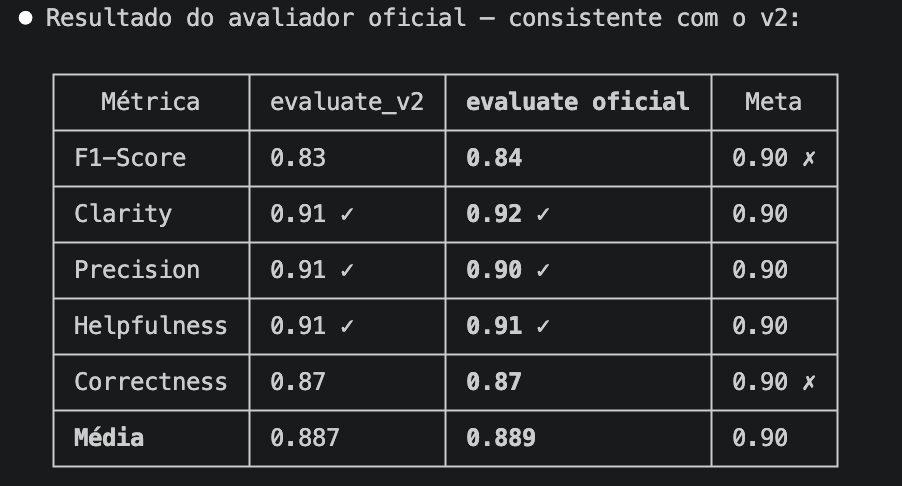

# experimento 5

1. pegar o melhor prompt ate agora e executa lo, avaliar os piores casos de f1 (principalemnte Recall). e ir muito pontual nas alterações pq a cada mexida muda todo o modelo. quando acho uma correção, pergunto se ela pode afetar o restante e ajusto para nao afetar as outras notas, pois a estrategia eh ir mto pontual no erro agora.

- alterações
    - caso 5: race condition para caso de prevenção em carrinho
    - caso 12: persona usuaria do dash extrair do contexto do bug

- resultados 
    - F1 subiu +0.01 mas Precision cedeu -0.01 — trade-off quase neutro. Os casos 5 e 12 podem ter melhorado individualmente mas a mudança não moveu a agulha no geral.

2. O modelo tem limitações, algumas precisaremos aceitar que o score nao vai subir
    - exemplos: 
        "O recall do ex5 tem teto limitado pelo gold label: detalhes como '15 minutos', 'ao ir para checkout' e 'estoque limitado' são inferências do avaliador que não aparecem no bug report de entrada. O modelo demonstrou compreensão correta do conceito de prevenção, mas não tem base para reproduzir valores arbitrários não presentes no input. Score aceito como limite superior atingível para este caso."

        "ex 10: "Recall limitado pelo ground of truth: 'log de auditoria' é boa prática inferida pelo avaliador, não derivável do bug report — teto aceito."

        "ex 1: de 10 possiveis correções 8 são "teto do ground truth" e eu nao consigo prever ou inferir"

     - Três instruções foram adicionadas ao passo de análise do prompt para capturar padrões recorrentes de omissão: notificação de múltiplos atores afetados, processamento assíncrono em exportações pesadas, e atomicidade em operações com dependência de ordem. As demais omissões identificadas (CRDTs, valores numéricos como 5MB/chunk e lotes de 50, estratégia de cache híbrida, materialized views e regras de negócio não definidas no bug report) foram aceitas como teto do ground truth, por dependerem de inferências do avaliador não deriváveis do input.
    
        - F1 subiu para 0.84 — o melhor valor até hoje. Precision ficou exatamente em 0.90 (no limiar). Falta empurrar F1 de 0.84 → 0.90, o que requer recall subindo de ~0.80 para ~0.88.

3. Avaliação de todos os casos que e possivel inferir ou ajustar o prompt com base no bug report, os demais serao aceitos
    - 5 novos bullets no Passo 5: paridade entre ambientes, modal/overlay, layout quebrado, validação de input e contagem incorreta.

    - pouca variação, não valeu mto a pena : 
        Média geral subiu levemente (+0.003) mas F1 cedeu -0.01. Dentro da variância normal do avaliador. Pode continuar com a próxima alteração.

